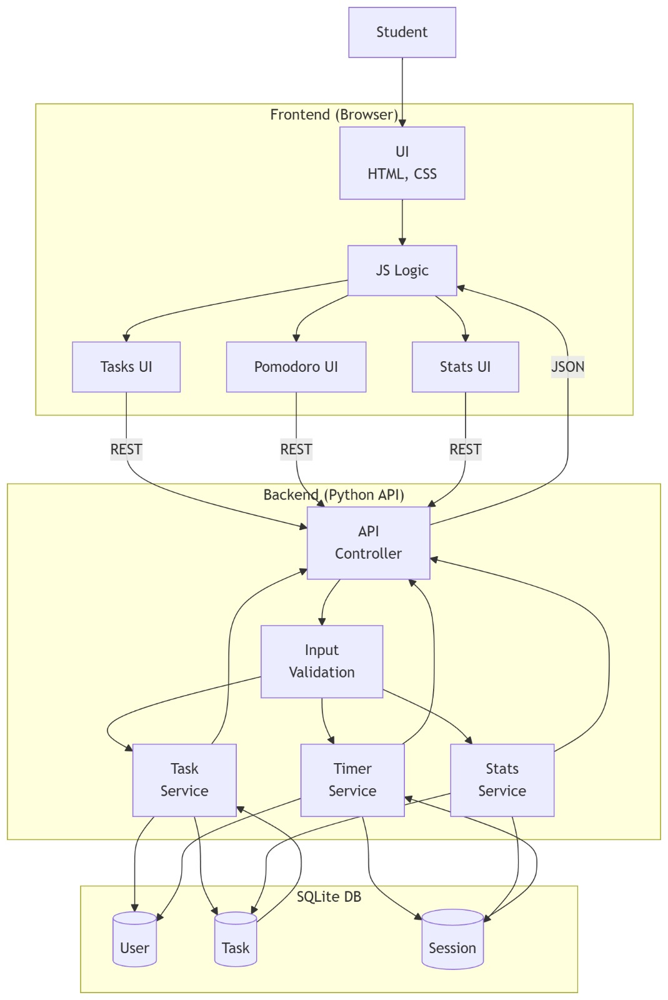
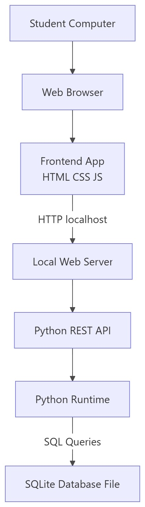
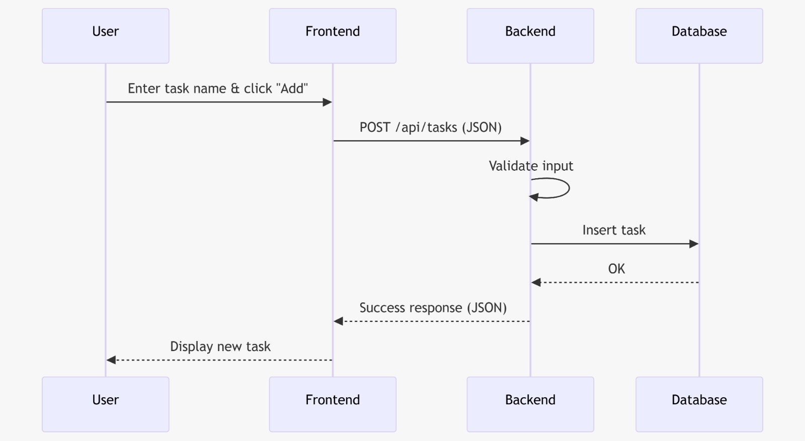
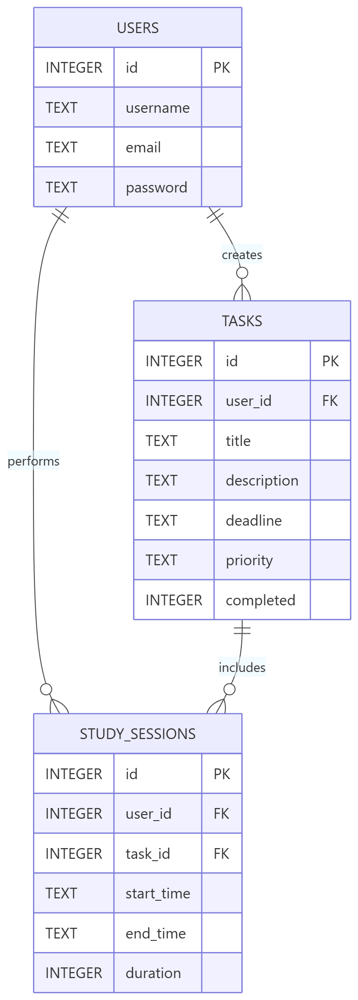

# Detailed architectural information will be added as the development process progresses.
# ARCHITECTURE.md

# Title Page
**Document Name:** Software Architecture Document  
**Project Name:** StudySprint  
**Date:** April 2026  

---

## Change History
* **Version 1.0:** Initial draft of the architecture document.

---

## Table of Contents
1. Scope
2. References
3. Software Architecture
4. Architectural Goals & Constraints
5. Logical Architecture
6. Process Architecture
7. Development Architecture
8. Physical Architecture
9. Scenarios
10. Size and Performance
11. Quality
* Appendices

---

## List of Figures
* Figure 1: Logical Architecture Diagram
* Figure 2: Physical Architecture Diagram
* Figure 3: Sequence Diagram
* Figure 4: Database Schema Diagram

---

## Logical Architecture Diagram

**Figure 1:** Logical Architecture Diagram of StudySprint. Shows the interaction between the frontend, backend, and database layers.

## Physical Architecture

**Figure 2:** Physical Architecture Diagram of StudySprint. Illustrates the physical deployment of the StudySprint system. The frontend runs in a web browser, while the backend and SQLite database run locally on the same machine during development.

## Sequence Diagram

**Figure 3:** Sequence Diagram for Adding a Task. Illustrates the sequence diagram of the StudySprint system for the "Add Task" scenario. Shows the interaction order between the user, frontend, backend, and database, including request handling, data validation, and response flow during task creation.

## Database Schema

**Figure 4:** Database Schema of StudySprint. Shows the users, tasks, and study_sessions tables and their relationships.

---

## 1. Scope
This document explains the software architecture of StudySprint. StudySprint is a web application for student productivity. It includes task management, a Pomodoro timer, and study statistics. This document is for developers, testers, and project managers.

## 2. References
* StudySprint Project Requirements Document
* Python and SQLite Official Documentation

## 3. Software Architecture
The system uses a Client-Server architecture. We separate the frontend (user interface) from the backend (data and logic). This makes the system easier to build and maintain.

## 4. Architectural Goals & Constraints
**Goals:**
* **Simplicity:** Keep the code easy to read and understand.
* **Modularity:** Separate frontend and backend completely.

**Constraints:**
* **Technology:** Must use Python and SQLite for the backend. Must use HTML, CSS, and JavaScript for the frontend.
* **Time:** The project has a strict deadline. Complex frameworks are avoided.

## 5. Logical Architecture
The system has three main parts:
1.  **Frontend (Client):** Handles the user interface. Built with HTML, CSS, and JavaScript.
2.  **Backend (Server):** Handles business logic. Built with Python as a REST API.
3.  **Database:** Stores user data, tasks, and study sessions. Uses SQLite.

## 6. Process Architecture
The application works synchronously. 
1. The user clicks a button on the website.
2. The frontend sends an HTTP request to the backend API.
3. The backend processes the request and updates the SQLite database.
4. The backend sends a JSON response back to the frontend.
5. The frontend updates the screen.

## 7. Development Architecture
* **Version Control:** Git and GitHub are used to track changes.
* **Code Structure:** The project has separate folders for `frontend/` and `backend/`.
* **Team Roles:** Frontend and backend development happen at the same time by different team members.

## 8. Physical Architecture
For development and testing, the system runs locally on the developers' computers. 
* A local web server runs the Python backend.
* A standard web browser runs the frontend.
* The SQLite database is a local file on the server.

## 9. Scenarios
**Example Scenario: Adding a Task**
1. User types a new task name and clicks "Add".
2. Frontend sends a `POST` request with the task details to the backend.
3. Backend validates the data and saves it to the SQLite database.
4. Backend replies with a success message.
5. Frontend shows the new task on the screen.

## 10. Size and Performance
* **Size:** This is a small-scale application meant for individual student use.
* **Performance:** The REST API must reply quickly. Page loads and button clicks should take less than 1 second. SQLite is fast enough for our data size.

## 11. Quality
* **Reliability:** The Pomodoro timer must be accurate and not reset randomly.
* **Usability:** The interface must be clear and simple for students.
* **Maintainability:** The code must be well-commented so team members can read it easily.

---

## Appendices

### Acronyms and Abbreviations
* **API:** Application Programming Interface
* **REST:** Representational State Transfer
* **UI:** User Interface
* **JSON:** JavaScript Object Notation

### Definitions
* **Pomodoro Timer:** A time management method. It breaks work into intervals, usually 25 minutes long, separated by short breaks.
* **Endpoint:** A specific URL where the API can be accessed.

### Design Principles
* **Separation of Concerns:** Keep the visual parts (frontend) separate from the data parts (backend).
* **KISS (Keep It Simple, Stupid):** Do not add unnecessary features. Focus on the core goals of the project.